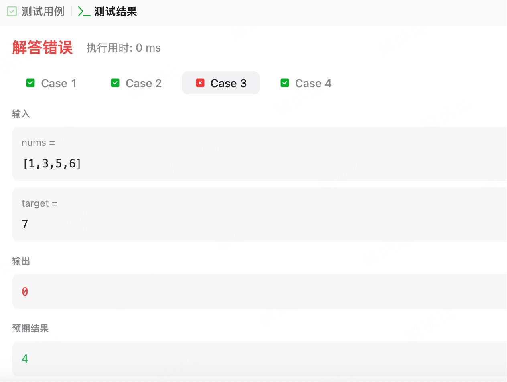

标准的二分：

```swift
func binarySearch(_ array:[Int], _ target: Int) -> Int {
    var l = 0
    var r = array.count - 1
    while l <= r {
        let mid = l + (r - l) >> 1
        if array[mid] == target {
            return mid
        }else if array[mid] < target {
            l = mid + 1
        }else {
            r = mid - 1
        }
    }
    return -1
}
```

leetcode有个变种，35.搜索插入位置：

https://leetcode.cn/problems/search-insert-position/description/

本质是找第一个大于等于target的索引（target可能不存在，所以变种为找大于等于taget的最小index）

所以==target要和>target合并，然后顺手搞个标记录一下满足大于等于的index

```swift
func searchInsert(_ nums: [Int], _ target: Int) -> Int {
      if nums.first! > target {return 0}
      var l = 0
      var r = nums.count - 1
      var rs = 0
      while l <= r {
          let mid = l + (r - l) >> 1
          if nums[mid] >= target {
              rs = mid
              r = mid - 1
          }else {
              l = mid + 1
          }
      }
      return rs
  }
```

这样提交下，有的case跑不过，数组最大值仍比target小的场景：



这时候需要返回nums.count

可以搞个bool标记录一下，nums[mid] >= target 这个if是不是走进去过。没走过则返回nums.count

```swift
class Solution {
    func searchInsert(_ nums: [Int], _ target: Int) -> Int {
        var l = 0
        var r = nums.count - 1
        var rs = 0
        var match = false
        while l <= r {
            let mid = l + (r - l) >> 1
            if nums[mid] >= target {
                rs = mid
                r = mid - 1
                match = true
            }else {
                l = mid + 1
            }
        }
        return match ? rs : nums.count
    }
}
```

这样就AC了。题解里是比较取巧的直接rs初始化为nums.count了。